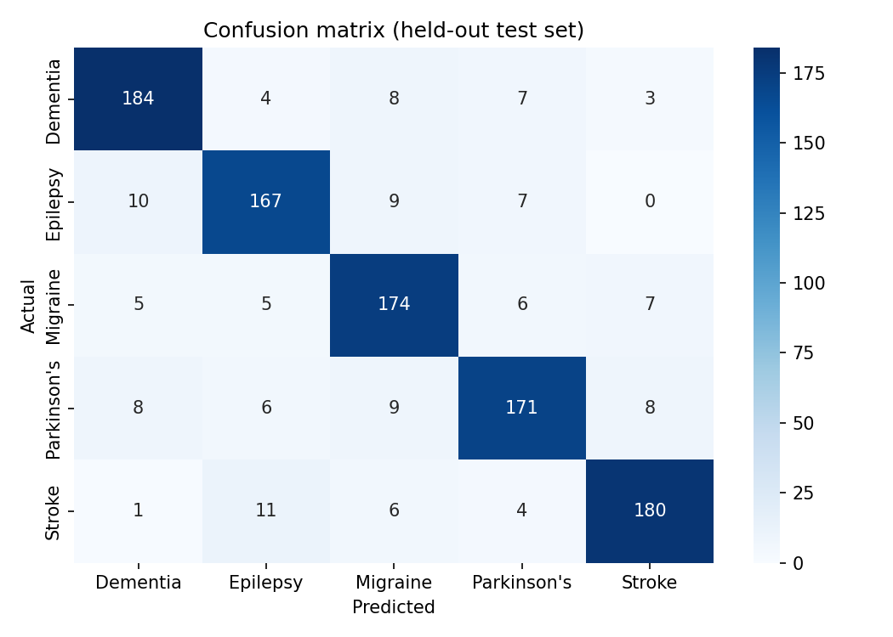

# 🧠 NeuroCare — Neurological Symptom Checker Chatbot

A conversational assistant that collects a user's symptoms through a chat interface and ranks the most likely neurological conditions using a machine-learning classifier. An LLM handles the conversation and symptom extraction; a trained model does the prediction.

> ⚠️ **Disclaimer** — This is an educational project, **not a medical device**. It must not be used for diagnosis or to make health decisions. Always consult a qualified healthcare professional.

## How it works

```
User message
     │
     ▼
┌──────────┐   small talk    ┌──────────────┐
│  Router  │ ───────────────▶│ LLM chat reply│
│ (LLM)    │                 └──────────────┘
└────┬─────┘
     │ symptoms
     ▼
┌────────────────────┐    ┌──────────────────────┐    ┌───────────────────────┐
│ LLM symptom        │───▶│ Session symptom list │───▶│ Logistic Regression   │
│ extraction (JSON)  │    │ (follow-up questions)│    │ → top-3 conditions    │
└────────────────────┘    └──────────────────────┘    └───────────┬───────────┘
                                                                  ▼
                                                      LLM plain-language explanation
```

1. **Router** classifies each message as `CHAT` (greeting / off-topic) or `DIAG` (symptoms).
2. **Extraction** turns free text into a JSON list of symptoms.
3. **Dialogue manager** asks follow-up questions until at least 3 symptoms are collected (or the user asks to finish).
4. **Predictor** (multi-label binarizer + Logistic Regression) returns the top-3 conditions with probabilities.
5. **Explanation** — the LLM summarises the result in simple, non-committal language.

Conditions covered: Dementia, Epilepsy, Migraine, Parkinson's disease, Stroke.

## Tech stack

Python · Flask · scikit-learn · pandas · Groq API (`llama-3.1-8b-instant`) · HTML/CSS/JavaScript

## Project structure

```
neurocare-chatbot/
├── app.py                  # Flask entry point
├── neurocare/              # Core package
│   ├── chatbot.py          # Dialogue pipeline
│   ├── llm.py              # Groq LLM wrapper (chat, extraction)
│   ├── router.py           # CHAT / DIAG classifier
│   └── predictor.py        # ML inference
├── ml/                     # Data preparation, training, evaluation
│   ├── clean_dataset.py
│   ├── train_model.py
│   └── evaluate.py
├── data/                   # Cleaned dataset (5,000 samples)
├── models/                 # Trained model + symptom vocabulary (.pkl)
├── web/                    # Frontend (templates + static assets)
├── tests/                  # Unit tests (no API key required)
└── docs/                   # Figures
```

## Getting started

```bash
git clone https://github.com/<your-username>/neurocare-chatbot.git
cd neurocare-chatbot

python -m venv .venv
source .venv/bin/activate        # Windows: .venv\Scripts\activate
pip install -r requirements.txt

cp .env.example .env             # then add your own GROQ_API_KEY
python app.py                    # open http://localhost:5000
```

A free API key is available from the [Groq console](https://console.groq.com/).

## Model training & evaluation

```bash
python -m ml.train_model     # retrain and overwrite models/*.pkl
python -m ml.evaluate        # held-out evaluation + confusion matrix
python -m pytest             # run the tests
```

The evaluation trains a fresh model on 80% of the data and scores it on the remaining 20% (stratified, `random_state=42`):

| Metric (weighted) | Score |
|---|---|
| Accuracy | 0.876 |
| Precision | 0.876 |
| Recall | 0.876 |
| F1-score | 0.876 |



> The pickled models were produced with scikit-learn 1.x; if you hit a version warning, simply re-run `python -m ml.train_model`.

## Known limitations

- **Dataset**: the 5,000 samples are word-level symptom descriptions; their source/licence should be documented here. Scores on this data do not reflect real clinical performance.
- **Vocabulary mismatch**: the model's vocabulary is made of single words (e.g. `blurred`, `vision`), while the LLM may return multi-word symptoms (`blurred vision`) or variants (`tremors` vs `tremor`); unmatched terms can be ignored by the predictor.
- **Session state**: the conversation state is a single global list, so the app supports one user at a time (not suitable for concurrent users as is).
- **No clinical validation**, and only 5 conditions are covered.

## Roadmap

- Per-user sessions (Flask sessions or a session id)
- Symptom normalisation (lemmatisation / phrase-to-token mapping)
- Compare models (Random Forest, gradient boosting) with cross-validation
- Dockerfile and CI (GitHub Actions)

## License

MIT — see [LICENSE](LICENSE).
